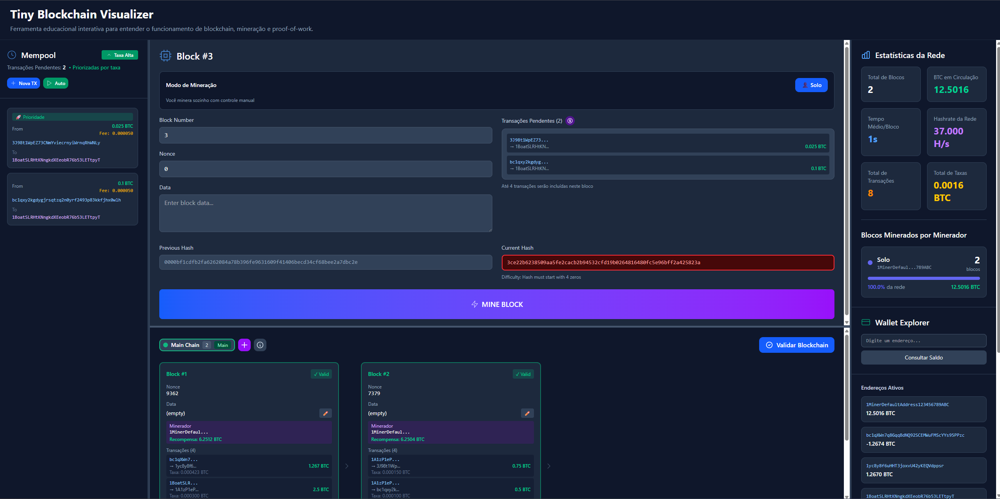

# Tiny Blockchain - Angular

Ferramenta educacional interativa para entender o funcionamento de blockchain, mineração e proof-of-work.



## 🚀 Funcionalidades

### 📦 Core Blockchain

- **Mineração de Blocos**: Proof-of-work com dificuldade 4 (prefixo "0000")
- **Mempool**: Pool de transações pendentes com sistema de taxas
- **Hash SHA-256**: Cálculo de hash criptográfico usando crypto-js
- **Validação de Cadeia**: Verificação de integridade da blockchain

### 💰 Sistema Financeiro

- **Transações**: Transferências entre endereços com taxas configuráveis
- **Recompensas de Mineração**: 6.25 BTC + taxas das transações
- **Wallet Explorer**: Visualização de saldos e histórico de transações (counterparty completo)
- **Priorização por Taxa**: Toggle para ordenar mempool por taxa (habilitado por padrão)

### 🏁 Mineração Competitiva

- **Modo Solo**: Mineração individual com controle manual
- **Modo Competição**: 3 mineradores simultâneos competindo
- **Diferentes Hash Rates**: Alice (15k), Bob (12k), Charlie (10k)
- **Visualização em Tempo Real**: Progresso de cada minerador durante a corrida
- **Batches Configuráveis**: Processamento em lotes para simular trabalho assíncrono

### 🔀 Sistema de Forks

- **Criação de Forks**: Bifurcação da cadeia em pontos específicos
- **Seleção de Fork**: Escolha em qual fork minerar novos blocos
- **Consenso Automático**: Cadeia mais longa sempre vence
- **Visualização de Múltiplas Cadeias**: Identificação visual de cada fork com abas

### 🛡️ Demonstração de Segurança

- **Tamper de Blocos**: Editar dados de blocos existentes (quebra integridade)
- **Validação Visual**: Blocos inválidos destacados em vermelho
- **Detecção de Alterações**: Verificação automática de hashes
- **Invalidação Automática**: Edições marcam o bloco como inválido

### 📊 Dashboard de Estatísticas

- Total de blocos minerados
- BTC em circulação
- Tempo médio entre blocos
- Hashrate da rede
- Estatísticas por minerador (blocos minerados)
- Total de transações processadas e taxas coletadas

## 🎯 Como Usar

### 1. Criar Transações

- **Manual**: Preencha sender, receiver, amount e fee
- **Automático**: Ative geração automática de transações aleatórias
- **Priorização**: Toggle para ordenar por taxa

### 2. Minerar Blocos

1. Escolha o **modo de mineração** (Solo ou Competição)
2. Se houver forks, **selecione qual fork minerar**
3. Clique em "MINE BLOCK" ou "START MINING RACE"
4. Aguarde o proof-of-work ser encontrado

### 3. Validar Integridade

1. Clique em "Validar Blockchain" no header
2. Veja resultado: cadeia válida ou blocos inválidos

### 4. Quebrar Integridade (Educacional)

1. Clique no ícone ✏️ em qualquer bloco minerado
2. Edite os dados do bloco
3. Clique em "💥 Tamper"
4. Valide novamente para ver o bloco ficar inválido

### 5. Criar e Trabalhar com Forks

1. Clique em "Mostrar" no Fork Visualizer
2. Crie um fork manualmente com "+ Criar Fork Manual"
3. Selecione o fork desejado antes de minerar
4. Mine blocos em diferentes forks
5. Observe o consenso: fork mais longo vira cadeia principal

## 🛠️ Tecnologias

- **Angular 21**: Framework principal com standalone components
- **Signals & Computed**: Sistema reativo do Angular para estado gerenciado
- **Tailwind CSS 4**: Estilização utilitária com `@tailwindcss/postcss`
- **crypto-js**: Hashing SHA-256
- **TypeScript 5.9**: Tipagem estática
- **ng-icons/lucide**: Ícones
- **class-variance-authority & clsx**: Utilitários de estilo
- **Vitest**: Test runner

## 📁 Estrutura do Projeto

```
src/app/
├── app.ts                    # Componente principal com layout e resize
├── components/
│   ├── blockchain-display/   # Exibição da cadeia de blocos
│   ├── fork-tabs/            # Seletor de forks
│   ├── fork-visualizer/      # Visualização de bifurcações
│   ├── mempool-sidebar/      # Sidebar de transações pendentes
│   ├── mining-block/         # Interface de mineração (solo/competição)
│   ├── mining-race/          # Visualização da corrida de mineração
│   ├── stats-dashboard/      # Dashboard de estatísticas
│   ├── transaction-card/     # Card de transação individual
│   ├── wallet-explorer/      # Explorador de carteiras e saldos
│   └── ui/                   # Componentes UI reutilizáveis
├── models/
│   ├── blockchain.model.ts   # Interfaces Block e Transaction
│   ├── fork.model.ts         # Interfaces Fork
│   └── miner.model.ts        # Interfaces Miner e MiningProgress
└── services/
    ├── blockchain.ts         # Serviço principal de blockchain
    ├── fork.service.ts       # Gerenciamento de forks
    └── mining.service.ts     # Simulação de mineração competitiva
```

## 🚀 Scripts Disponíveis

### Desenvolvimento

```bash
npm start
```

Inicia o servidor de desenvolvimento em `http://localhost:4200/` com live reload.

### Build

```bash
npm run build
```

Compila o projeto para produção na pasta `dist/`.

### Testes

```bash
npm test
```

Executa os testes unitários com [Vitest](https://vitest.dev/).

### Lint

```bash
npm run lint        # Verifica problemas de lint
npm run lint:fix    # Corrige problemas automaticamente
```

## 📝 Convenções de Código

- **Standalone Components**: Todos os componentes usam standalone API
- **Dependency Injection**: Uso de `inject()` ao invés de constructor injection
- **Signals**: Estado reativo com `signal()`, `computed()` e `effect()`
- **Tailwind Utilities**: Estilização prioritariamente com classes utilitárias
- **Conventional Commits**: Commits formatados (lowercase) conforme `.github/commit-instructions.md`

## 🧪 Testes

Testes unitários cobrem:
- Componentes principais (app, mining-block, mempool-sidebar, etc.)
- Serviço de blockchain (adição de blocos, validação, tamper)
- Lógica de transações e mempool

Execute com `npm test` para rodar todos os testes.

## 📚 Recursos Adicionais

- [Angular CLI](https://angular.dev/tools/cli)
- [Angular Signals](https://angular.dev/guide/signals)
- [Tailwind CSS](https://tailwindcss.com/)
- [Vitest](https://vitest.dev/)
